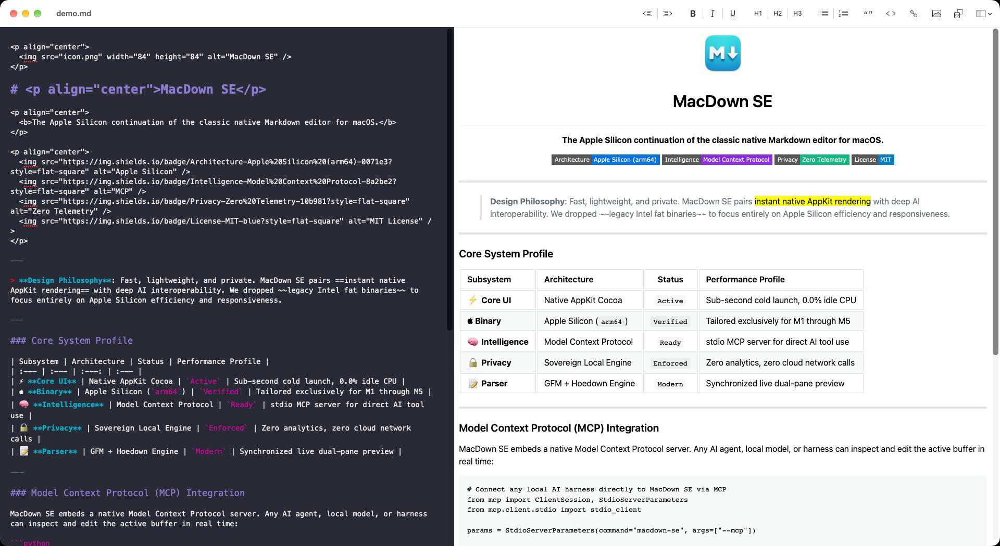

# MacDown SE

The Apple Silicon continuation of the classic native Markdown editor.

MacDown SE 1.0.0 is maintained by Eldris Inc. and released under the MIT License.
It builds natively for Apple Silicon and Intel, with macOS 12 or later required.

> MacDown SE continues the original MacDown foundation created by Tzu-ping Chung
> (uranusjr) during 2014–2020, together with its contributors. MacDown was inspired
> by Chen Luo's Mou. We preserve that lineage and the original contributor credits.

## Install

Download `MacDown-SE-universal.zip` from a successful
[build workflow](https://github.com/eldris-io/macdown-se/actions/workflows/build.yml)
or build from source below. Unzip it and drag `MacDown SE.app` into Applications.
CI artifacts are development builds, not notarized releases.

## Screenshot



## License

MacDown SE is released under the terms of MIT License. You may find the content of the license [here](http://opensource.org/licenses/MIT), or inside the `LICENSE` directory.

You may find full text of licenses about third-party components in the `LICENSE` directory, or the **About MacDown SE** panel in the application.

The following editor themes and CSS files are extracted from [Mou](http://mouapp.com), courtesy of Chen Luo:

* Mou Fresh Air
* Mou Fresh Air+
* Mou Night
* Mou Night+
* Mou Paper
* Mou Paper+
* Tomorrow
* Tomorrow Blue
* Tomorrow+
* Writer
* Writer+
* Clearness
* Clearness Dark
* GitHub
* GitHub2

## Development

### Requirements

MacDown SE builds as a Universal 2 application for macOS 12 or later.

Requirements: Xcode with the macOS SDK, Git, CocoaPods 1.17.0, and Node.js 22
or later. Local validation uses Xcode 27. The XCTest bundle requires macOS 14
or later because the current Xcode XCTest framework has that minimum; the app,
command-line helper, parser, and pods retain their macOS 12 deployment target.

### Environment Setup

From the repository root:

```sh
git submodule update --init --recursive
pod install
npm ci --prefix Tools/GitHub-style-generator
make -C Tools/GitHub-style-generator
make -C Dependency/peg-markdown-highlight -j$(sysctl -n hw.ncpu)
xcodebuild -workspace MacDown.xcworkspace -scheme MacDown -configuration Release \
  ARCHS="arm64 x86_64" ONLY_ACTIVE_ARCH=NO -derivedDataPath build build
lipo -info "build/Build/Products/Release/MacDown SE.app/Contents/MacOS/MacDown SE"
```

Open `MacDown.xcworkspace` for development. On Apple Silicon, run the tests with:

```sh
xcodebuild test -workspace MacDown.xcworkspace -scheme MacDown \
  -destination 'platform=macOS,arch=arm64'
```

The GitHub Actions build runs on `macos-14` and `macos-latest`, checks both binary
architectures, runs native tests, and uploads a zipped app. These CI artifacts
are development builds, not Developer ID signed or notarized releases.

### Translation

Please help translation on [Transifex](https://www.transifex.com/macdown/macdown/).


## Contributing

Report issues and contribute to [eldris-io/macdown-se](https://github.com/eldris-io/macdown-se).
The original [MacDown project](https://github.com/MacDownApp/macdown) and its
contributors remain credited in the application and retained license notices.

MacDown SE uses Hoedown for Markdown rendering, Prism for syntax highlighting,
and PEG Markdown Highlight for editor highlighting. Third-party licenses are
retained in `LICENSE` and the About panel.
